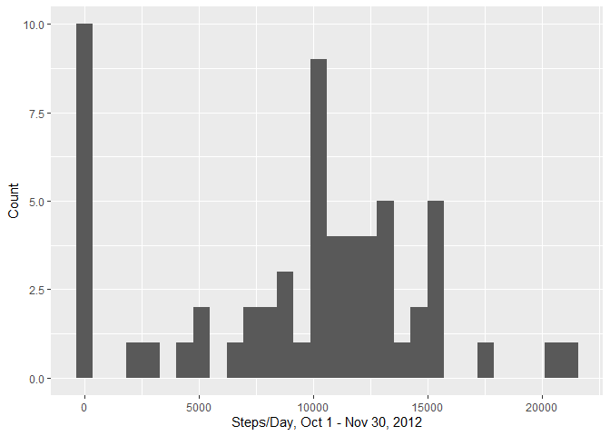
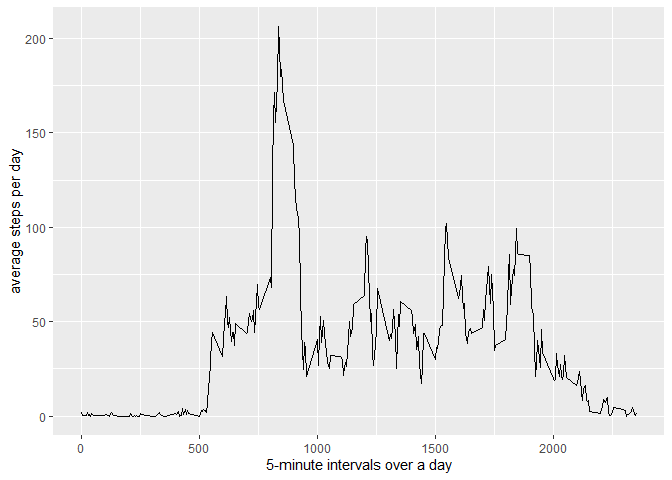
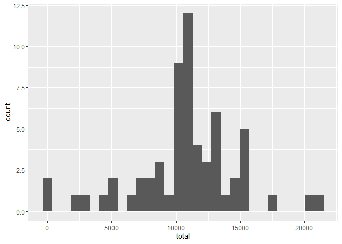
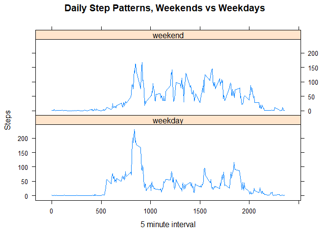

Assignment 1 for Reproducible Research, Week Two
==================================================


First, we attach libraries, read in the data, and look at dataframe.


```r
library(tidyverse)
```

```
## -- Attaching packages ------------------------------------------------------------------- tidyverse 1.3.0 --
```

```
## v ggplot2 3.2.1     v purrr   0.3.3
## v tibble  2.1.3     v dplyr   0.8.3
## v tidyr   1.0.0     v stringr 1.4.0
## v readr   1.3.1     v forcats 0.4.0
```

```
## -- Conflicts ---------------------------------------------------------------------- tidyverse_conflicts() --
## x dplyr::filter() masks stats::filter()
## x dplyr::lag()    masks stats::lag()
```

```r
dat <- read_csv("activity.csv")
```

```
## Parsed with column specification:
## cols(
##   steps = col_double(),
##   date = col_date(format = ""),
##   interval = col_double()
## )
```

```r
str(dat)
```

```
## Classes 'spec_tbl_df', 'tbl_df', 'tbl' and 'data.frame':	17568 obs. of  3 variables:
##  $ steps   : num  NA NA NA NA NA NA NA NA NA NA ...
##  $ date    : Date, format: "2012-10-01" "2012-10-01" ...
##  $ interval: num  0 5 10 15 20 25 30 35 40 45 ...
##  - attr(*, "spec")=
##   .. cols(
##   ..   steps = col_double(),
##   ..   date = col_date(format = ""),
##   ..   interval = col_double()
##   .. )
```


# Question 1: Steps per day
The total number of steps per day is reported in the table.
The mean and median total number of steps per day is 9354.23 and 10395, respectively.

```r
#
perday <- dat %>% 
  group_by(date) %>% 
  summarize(total = sum(steps, na.rm = TRUE),
         average = mean(steps, na.rm = TRUE),
        mediam = median(steps, na.rm = TRUE)) 
perday
```

```
## # A tibble: 61 x 4
##    date       total average mediam
##    <date>     <dbl>   <dbl>  <dbl>
##  1 2012-10-01     0 NaN         NA
##  2 2012-10-02   126   0.438      0
##  3 2012-10-03 11352  39.4        0
##  4 2012-10-04 12116  42.1        0
##  5 2012-10-05 13294  46.2        0
##  6 2012-10-06 15420  53.5        0
##  7 2012-10-07 11015  38.2        0
##  8 2012-10-08     0 NaN         NA
##  9 2012-10-09 12811  44.5        0
## 10 2012-10-10  9900  34.4        0
## # ... with 51 more rows
```

```r
mean(perday$total)
```

```
## [1] 9354.23
```

```r
median(perday$total)
```

```
## [1] 10395
```


## Histogram of total steps per day

```r
ggplot(data = perday, mapping = aes(total))+
  geom_histogram()+
  labs(x = "Steps/Day, Oct 1 - Nov 30, 2012",
       y = "Count")
```

```
## `stat_bin()` using `bins = 30`. Pick better value with `binwidth`.
```

<!-- -->

# Question 2: Average daily activity pattern

This is a time series plot of the 5-minute internal number of steps, averaged across all days. Then we use the which function to find the row with the largest average. The interval with the largest average is 835, which has an average of 206.17 steps.


```r
perinterval <- dat %>% 
  group_by(interval) %>% 
  summarize(average = mean(steps, na.rm = TRUE)) %>% 
  ungroup()
  

ggplot(data = perinterval, mapping = aes(x = interval, y = average))+
  geom_line()+
  labs(x = "5-minute intervals over a day",
       y = "average steps per day")
```

<!-- -->

```r
which(perinterval$average == max(perinterval$average))
```

```
## [1] 104
```

# Question 3: Imputing missing values

To determine how many missing values in the data set, we is the is.na() function on the steps variable. There are 2304 missing observations.

To impute the missing values, we will fill in a missing value with the average number of steps in that interval.

We then group by the day and make a histogram of the total number of steps per day.

Surprisingly, both the mean and median of the imputed total number of steps per day is 10766.19 ,which is higher than the values calculated from the incomplete dataset: 9354.23 and 10395.


```r
sum(is.na(dat$steps))
```

```
## [1] 2304
```

```r
dat_impute <- left_join(dat, perinterval, by = "interval")

dat_impute$steps_impute <- ifelse(is.na(dat_impute$steps), dat_impute$average, dat_impute$steps)

dat_impute <- dat_impute %>% 
  group_by(date) %>% 
  summarise(total = sum(steps_impute),
         average = mean(steps_impute, na.rm = TRUE),
        mediam = median(steps_impute, na.rm = TRUE)) %>% 
  ungroup()

ggplot(data = dat_impute, mapping = aes(total))+
  geom_histogram()
```

```
## `stat_bin()` using `bins = 30`. Pick better value with `binwidth`.
```

<!-- -->

```r
mean(dat_impute$total, na.rm = T)
```

```
## [1] 10766.19
```

```r
median(dat_impute$total, na.rm = T)
```

```
## [1] 10766.19
```

# Question 4: Differences in steps between weekdays and weekends?

In this secction we use the lubridate package to assign each day a label of either a weekday or weekend.  We average the the number of steps at each interval after grouping by whether or not the day was a weekend or weekday.  We finally use the lattice plot package to make a panel plot. We see that on weekends, people take similar amounts of steps thoughout the day, whereas on weekdays, people tend to walk most in the morning and a bit more in the evenings - likely off work hours. 


```r
library(lubridate)
```

```
## 
## Attaching package: 'lubridate'
```

```
## The following object is masked from 'package:base':
## 
##     date
```

```r
library(lattice)

dat_impute <- left_join(dat, perinterval, by = "interval")

dat_impute$steps_impute <- ifelse(is.na(dat_impute$steps), dat_impute$average, dat_impute$steps)

dat_impute$weekday <- weekdays(dat_impute$date)

dat_impute$weekend <- ifelse(dat_impute$weekday %in% c("Saturday", "Sunday"), "weekend", "weekday")

dat_impute_day <- dat_impute %>% 
  group_by(weekend, interval) %>% 
  summarise(average = mean(steps_impute))

xyplot(average ~ interval | weekend, data = dat_impute_day,
       main = "Daily Step Patterns, Weekends vs Weekdays",
       xlab = "5 minute interval", ylab = "Steps",
       layout = c(1,2),
       type = "l")
```

<!-- -->


